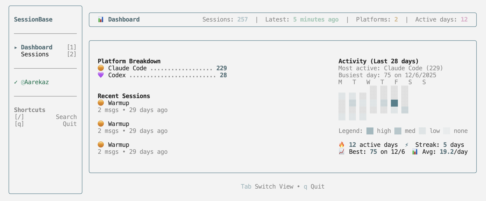

<p align="center">
  
</p>

# SessionBase CLI

**🚀 Interactive Terminal Dashboard** - The fastest way to manage your AI coding sessions

A powerful CLI tool for SessionBase featuring an interactive TUI dashboard to browse, search, and manage AI coding sessions from Claude Code, Gemini CLI, Amazon Q Chat, and OpenAI Codex CLI.

## 🖥️ Interactive Terminal Dashboard

Experience SessionBase through our powerful Terminal User Interface (TUI) - the fastest way to browse, search, and manage your AI coding sessions directly from your terminal.




### Launch the Dashboard

```bash
sessionbase dashboard
# or use the shorthand
sb dashboard
```

### Dashboard Features

**📊 Dashboard View**
- Session statistics and metrics
- Platform breakdown visualization
- Activity heatmap showing your coding patterns
- Quick access to recent sessions

**🔍 Sessions Browser**
- **Smart Date Grouping**: Sessions organized by "Today", "Yesterday", and specific dates
- **Advanced Search**: Filter by platform, search within session content, or browse by tags
- **Rich Metadata Display**: View message counts, timestamps, file paths, and project locations
- **Tag System**: Organize sessions with custom tags and filter by them
- **Split-Screen Details**: View session details alongside the list without losing context

**⌨️ Keyboard-First Navigation**
- **Instant Search**: Press `/` to focus search, `Enter` to apply
- **Platform Filters**: `a` (All), `c` (Claude), `g` (Gemini), `q` (Q Chat), `x` (Codex)
- **Sort Options**: Press `s` to cycle through Recent/Oldest/Title sorting
- **Session Details**: `Enter` to expand details, `Esc` to close
- **Efficient Movement**: Arrow keys for navigation, `Tab` to toggle focus

#### Complete Keyboard Reference

| Key | Action |
|-----|--------|
| `1` | Switch to Dashboard view |
| `2` | Switch to Sessions view |
| `↑` `↓` | Navigate sessions |
| `/` | Focus search bar |
| `Enter` | Apply search / Open session details |
| `Esc` | Clear search / Close details / Unfocus |
| `Tab` | Toggle focus between search and list |
| `a`, `c`, `g`, `q`, `x` | Filter by platform |
| `s` | Cycle sort order (Recent → Oldest → Title) |
| `q` or `Ctrl+C` | Quit dashboard |

## Quick Start

For more detailed documentation, see [docs.sessionbase.ai](https://docs.sessionbase.ai).

### Installation

Install the SessionBase CLI globally:

```bash
npm install -g @sessionbase/cli
```

This provides two commands:
- `sessionbase` - Main CLI interface with TUI dashboard
- `sb` - Shorthand alias for faster typing
- `sessionbase-mcp` - MCP server for AI platforms

### Authentication

Authenticate with your SessionBase account:

```bash
sessionbase login
```

This will open your browser to complete the authentication process with GitHub or Google.

Verify you're logged in:

```bash
sessionbase whoami
```

### Push Your First Session

Note that all sessions are public and discoverable by default, unless you supply the `--private` flag. Private sessions are only visible to the owner of the session.

Push your most recent AI chat session from your current directory:

```bash
# From Claude Code
sessionbase push --claude
# or
sb push --claude

# From Gemini CLI (after saving with /chat save)
sessionbase push --gemini

# From Amazon Q Chat
sessionbase push --qchat

# From OpenAI Codex CLI
sessionbase push --codex
```

**💡 Pro Tip**: Use the TUI dashboard (`sessionbase dashboard`) to browse your local sessions before pushing them to SessionBase!

## MCP Server Setup (Recommended)

The MCP server enables you to push sessions directly from your AI chat without breaking your workflow. Combine it with the interactive TUI dashboard for the complete SessionBase experience!

### Claude Code

```bash
claude mcp add sessionbase sessionbase-mcp --scope user
```

### Gemini CLI

Add to `~/.gemini/settings.json`:

```json
{
  "mcpServers": {
    "sessionbase": {
      "command": "sessionbase-mcp"
    }
  }
}
```

### Amazon Q Chat

Add to `~/.aws/amazonq/mcp.json`:

```json
{
  "mcpServers": {
    "sessionbase": {
      "command": "sessionbase-mcp"
    }
  }
}
```

### OpenAI Codex CLI

Add to `~/.codex/config.toml`:

```toml
[mcp_servers.sessionbase]
command = "sessionbase-mcp"
```

## Usage Examples

### Terminal Dashboard (Recommended)

```bash
# Launch the interactive TUI dashboard
sessionbase dashboard
sb dashboard  # shorthand alias

# Browse and manage all your sessions
# - Search by content or tags
# - Filter by AI platform
# - View session details and metadata
# - Push sessions directly from the interface
```

### CLI Commands

```bash
# List all sessions (local and remote)
sessionbase ls --global
sb ls --global

# Push private session with metadata
sessionbase push --claude --title "Debug Session" --tags "debugging,api" --private
sb push --claude --title "Debug Session" --tags "debugging,api" --private

# Push specific file
sessionbase push /path/to/session.json
sb push /path/to/session.json
```

### MCP Server (Natural Language)

Once configured, use natural language in your AI chat:

- "Push this to SessionBase"
- "Push this session as private with the tags 'API debugging'"

### Custom Slash Commands

**Claude Code**

```bash
mkdir -p ~/.claude/commands
echo "Use the sessionbase push_session tool to upload the current session" > ~/.claude/commands/upload.md
```

Now you can run `/upload` from Claude and it will automatically generate metadata and push to SessionBase. You can rename `upload.md` to create a different alias.

**Gemini CLI**

```bash
mkdir -p ~/.gemini/commands
touch ~/.gemini/commands/upload.toml
```

Add this content to `~/.gemini/commands/upload.toml`:

```toml
description="Upload the current session to SessionBase"
prompt= """
Use the sessionbase push_session tool to upload the current session.

If you see a warning that the most recent session is outdated, ask the user to run `/chat save <tag>` to save a new checkpoint, then re-run /upload.
"""
```

Now you can run `/upload` from Gemini CLI to automatically push sessions to SessionBase.

**Note:** Amazon Q Chat and OpenAI Codex CLI do not currently support custom slash commands. Use natural language instead (e.g., "Push this to SessionBase").

## Platform Support

| Platform | Local Storage | SessionBase Access |
|----------|----------------|-------------------|
| **Claude Code** | Stores all session files automatically | Can push current session or list/choose from directory |
| **Gemini CLI** | Only stores if you use `/chat save` | Can push saved sessions and list/choose from directory |
| **Amazon Q Chat** | Only stores most recent session per directory | Can detect and push current session automatically |
| **OpenAI Codex CLI** | Stores all session files automatically | Can push current session or list/choose from directory |

## Troubleshooting

### "No such file or directory" Error

Ensure the package is installed globally:

```bash
npm install -g @sessionbase/cli
which sessionbase-mcp  # Should show the binary path
```

### Authentication Issues

Verify you're logged in:

```bash
sessionbase whoami
```

If not authenticated, run `sessionbase login` again.

## Development

### Setup
```bash
# Install dependencies
npm install

# Build the CLI
npm run build

# Link globally for testing
npm link

# Verify installation
sessionbase --help
sessionbase --version

# Test the TUI dashboard
sessionbase dashboard
```

### Unlink (when done testing)
```bash
npm unlink -g
```
